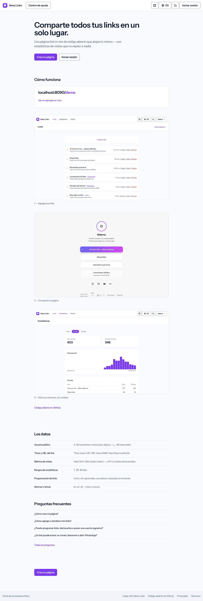
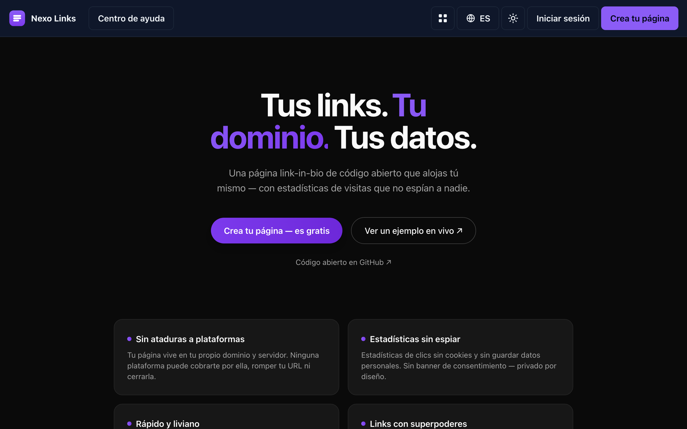

# Nexo Links

**Your links. Your domain. Your data.**

---

Nexo Links is an open-source, self-hosted link-in-bio platform — a Linktree
alternative you run on your own domain and infrastructure, designed to work
even on cheap shared hosting (PHP + MySQL).

## Why Nexo Links?

- **No vendor lock-in** — your page lives on *your* domain. No platform can
  take it away, paywall it, or shut it down.
- **Cookieless analytics** — click totals, unique visitors, daily series and
  top referrers with **zero cookies and zero personal data stored**. Visitor
  hashes rotate daily, so nobody can be tracked across days. No consent
  banner needed.
- **Fast by design** — server-rendered pages cached until content changes, no
  external requests (no CDNs, no font services, no trackers), system fonts,
  automatic dark mode.
- **Links with superpowers** — schedule by date, highlight what's live now,
  tease launches with a countdown that flips to a real button on time.
- **Fully customizable** — avatar, banner, accent palettes, solid or gradient
  backgrounds with automatic contrast so pages stay readable.
- **Social icons footer** — 13 platforms plus email/phone/website, with a
  WhatsApp link builder (country selector + prefilled message).
- **Share anywhere** — server-generated SVG QR code, ready to print.
- **Multilingual** — English, Spanish and Portuguese (`en`/`es`/`pt`) out of
  the box, with a visible switcher; public pages follow the visitor's browser
  language.
- **Part of the Nexo ecosystem** — the owner dashboard wears the shared Nexo
  chrome (violet brand, light/dark toggle, app-switcher and footer that link
  the other tools), while every public link-in-bio page keeps its own
  configurable per-page theme.
- **Community-safe** — anonymous report system for broken or abusive links,
  with owner notifications in the dashboard.
- **Accessible** — WCAG AA baseline: keyboard navigation, focus rings,
  labels, reduced-motion support and AA contrast.

## Screenshots

Captured from a local instance seeded with `DemoSeeder`, by
`node ~/alvaro/scripts/nexo-shots.mjs .` — never from production.

| Light | Dark |
| --- | --- |
|  |  |

See it for real at the [live demo](https://nexolinks.alvarocdev.com).

## Tech stack

Laravel 13 · MySQL 8 · Blade + Alpine.js + Tailwind CSS · Vite

Quality: [Pint](https://laravel.com/docs/pint) ·
[Larastan](https://github.com/larastan/larastan) ·
[Pest](https://pestphp.com) (200+ tests) · GitHub Actions CI

## Self-hosting

A standard Laravel app: PHP 8.3+, MySQL, and anything from cheap shared hosting to a
VPS. Multi-instance by design — your page lives on your own domain, with your own data.

**[docs/DEPLOYMENT.md](docs/DEPLOYMENT.md)** has the real steps: running it locally, the
environment reference (attribution, optional Nexo ID SSO, beacon) and the production
deploy.

## Project docs

- [Scope & roadmap](docs/SCOPE.md)
- [Wireframes](docs/WIREFRAMES.md)
- [Deployment guide](docs/DEPLOYMENT.md)
- [Contributing](CONTRIBUTING.md)

## Nexo ecosystem

Nexo is a family of open-source, self-hostable tools that share one visual identity,
one optional account ([Nexo ID](https://github.com/nexo-tools/nexo-id) SSO) and one set of
engineering standards. Every tool runs **fully standalone** — the ecosystem is opt-in.

| Tool | What it is | Live | Repo |
| --- | --- | --- | --- |
| **Nexo Tools** | Ecosystem hub — discover the tools and hop between them with one account | [nexotools.alvarocdev.com](https://nexotools.alvarocdev.com) | [nexo-tools](https://github.com/nexo-tools/nexo-tools) |
| **Nexo ID** | One account for every tool — OAuth 2.0 / OIDC SSO | [nexoid.alvarocdev.com](https://nexoid.alvarocdev.com) | [nexo-id](https://github.com/nexo-tools/nexo-id) |
| **Nexo Links** | Link-in-bio you host yourself (Linktree alternative) | [nexolinks.alvarocdev.com](https://nexolinks.alvarocdev.com) | — you are here |
| **Nexo Agenda** | Bookings for service businesses (Fresha / Booksy alternative) | [nexoagenda.alvarocdev.com](https://nexoagenda.alvarocdev.com) | [nexo-agenda](https://github.com/nexo-tools/nexo-agenda) |
| **Nexo Short** | URL shortener with private, cookieless stats | [nexoshort.alvarocdev.com](https://nexoshort.alvarocdev.com) | [nexo-short](https://github.com/nexo-tools/nexo-short) |
| **Nexo Events** | Event tickets, passes and QR check-in | [nexoevents.alvarocdev.com](https://nexoevents.alvarocdev.com) | [nexo-events](https://github.com/nexo-tools/nexo-events) |

New to Nexo? Start at **[nexotools.alvarocdev.com](https://nexotools.alvarocdev.com)**.
Built by **[alvarocdev.com](https://alvarocdev.com)** — the tech behind Nexo.

## License & credits

[MIT](LICENSE). Built by **Alvaro Carrizales** — [alvarocdev.com](https://alvarocdev.com).

---

Status: **live** at [nexolinks.alvarocdev.com](https://nexolinks.alvarocdev.com) — pages,
cookieless analytics, scheduling and countdowns, with optional Nexo ID sign-in.
